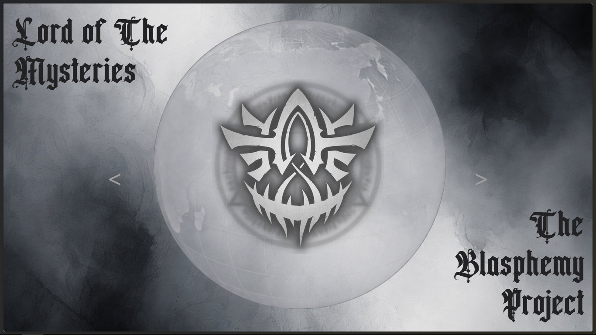

# The Blasphemy Project

## Overview

This is a frontend web application that visualizes and explores the Pathways system through an interactive interface. The project focuses on presenting pathways, sequences, and related data in a visual and navigable format, combining structured data with a dynamic UI.

This project is built as a technical and creative experiment to practice frontend architecture, component organization, and visual interaction design.

---

## Inspiration

This project is a **passion project inspired by the Pathways system from _Lord of the Mysteries (Book 1)_**.  
It is **not an official, licensed, or commercial project** and is not affiliated with the author or publisher in any way.  
All concepts are adapted purely for educational and personal use.

---

## Visual Preview

> Replace these images with real screenshots from your project.




---

## Technologies Used

- **React**
  - Component-based UI framework used to build the application.

- **JavaScript (ES6+)**
  - Application logic, state management, and interactions.

- **React Router**
  - Client-side routing for navigating between views.

- **Embla Carousel**
  - Smooth carousel navigation and animated transitions.

- **CSS3**
  - Layout, styling, transitions, and visual effects.

- **Node.js & npm**
  - Dependency management and build tooling.

---

## Architecture & How It Works

The application is a Single Page Application (SPA) built with React.

### Routing

- Routes define navigation between main and detail views.
- Dynamic route parameters are used to load pathway data.

### Data Layer

- Pathway data is defined as structured JavaScript objects.
- Components consume this data to render icons, descriptions, and relationships.

### Component Structure

- UI is split into reusable components.
- Each component is responsible for a single part of the interface.

### Navigation Flow

- Users start on the main view.
- Selecting an item navigates to a detail page.
- Arrows and keyboard navigation allow moving between entries.

### Styling

- CSS is used for layout, transitions, and visual hierarchy.
- Focus is on clarity, atmosphere, and readability.

---

## Folder Structure

```text
lotmpathways/
├── public/                     # Static files
├── screenshots/                # Images
├── src/
│   ├── assets/                 # Images, icons, cards
│   ├── components/             # Reusable React components, Pathway data
|   ├── fonts/                  # Reusable fonts
│   ├── pages/                  # Different pages
│   ├── styles/                 # CSS styles
│   ├── App.js                  # Root component
│   └── main.jsx / index.js     # Application entry point
├── package.json                # Dependencies and scripts
├── package-lock.json           # Dependency lockfile
└── README.md                   # Project documentation
```

---

## Installation and Setup

### Prerequisites

- Node.js (18+ recommended)
- npm or yarn

### Steps

- git clone https://github.com/SebastianSanchezTH/lotmpathways.git
- cd lotmpathways
- npm install
- npm start

The application will be available at: http://localhost:3000

---

## Troubleshooting

### Application does not start

- Ensure Node.js is installed
- Delete node_modules and reinstall dependencies

### Port already in use

- Stop other development servers
- Change the default port if needed

### Assets not loading

- Check relative paths for images and icons

---

## Contributing

This project is a personal passion project and is not actively accepting pull requests.

You are welcome to **clone, fork, and modify the project freely** for your own use, learning, or experimentation.  
If you have suggestions or feedback, feel free to open an issue for discussion.

No pull requests will be reviewed or merged at this time.

---

## License

This project is a fan-made, non-commercial passion project created for educational and personal use.

All images, names, and descriptive content are sourced from the _Lord of the Mysteries_ wiki and are the property of their respective owners.

This project is not affiliated with or endorsed by the original author, publisher, or rights holders.
